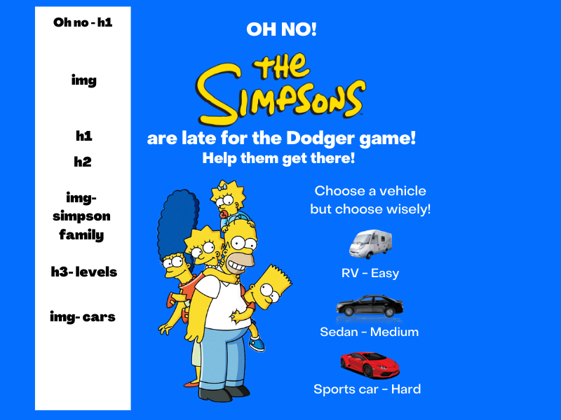
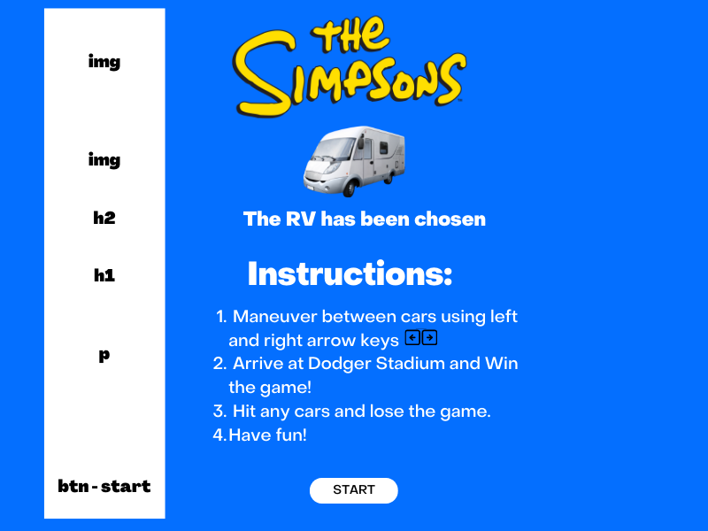
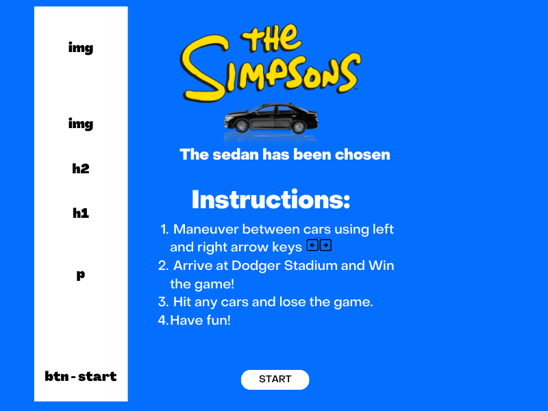
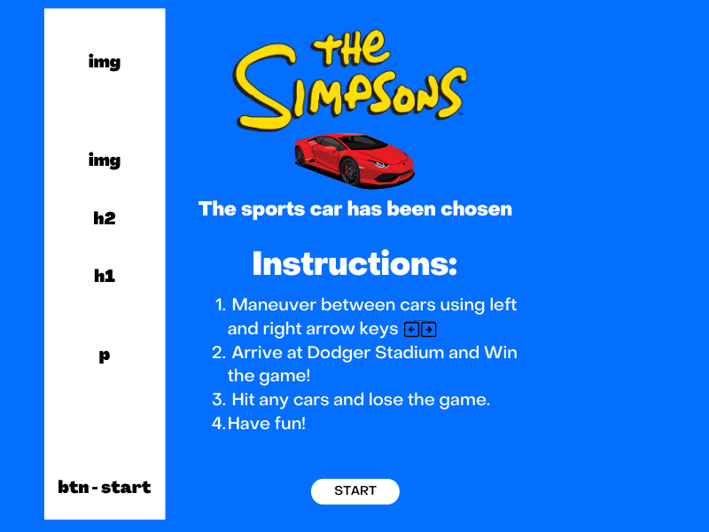
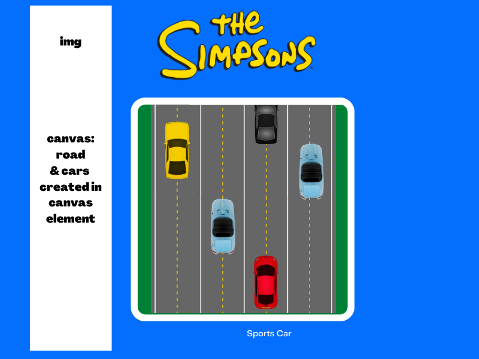
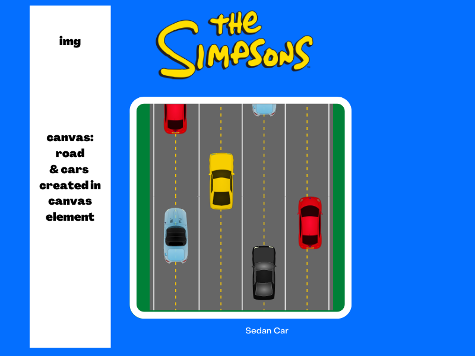
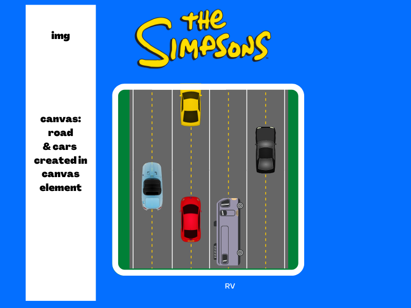
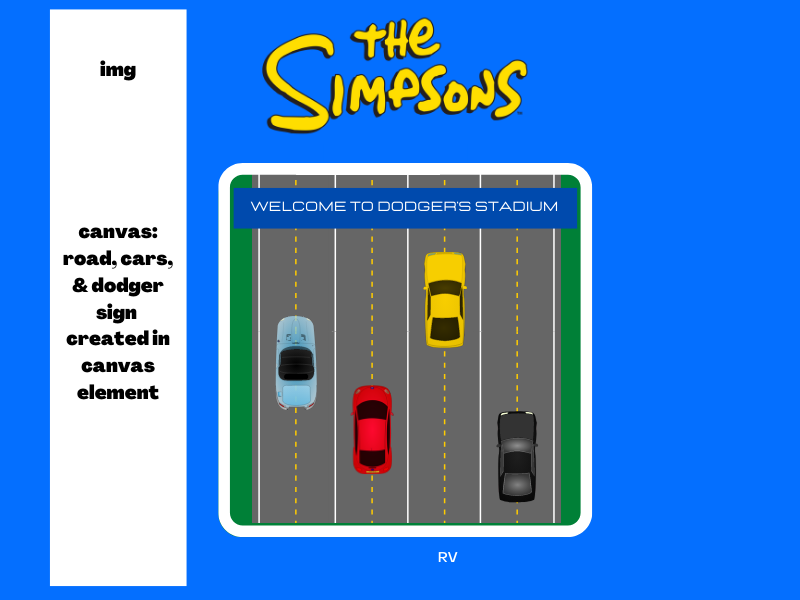
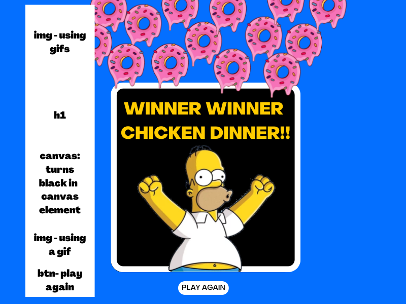

# Project_One_Game
HTML, CSS, JavaScript, Boostrap, and Canvas will be used to create this game.

# Story
Oh No! The Simpsons family are late to the Dodger game! You have to help them through LA traffic to get there before the game starts! Click the vehicle to start the game! 

# Instructions
1. Maneuver between cars using left and right arrow keys.
2. Arrive at Dodger Stadium and Win the  game!
3. Hit any cars and lose the game.
4. Have fun!

# Stretch Goals
1. You have three vehicle options. The easy level vehicle is a RV but it goes the slowest. The medium level vehicle is a prius that goes at moderate speed. The hard level vehicle is a sports car that goes the fastest but be careful the faster the car the faster the oncoming traffic comes! Choose wisely!
2. Each vehicle has a certain amount of damage they can take on the car before losing. The RV can only hit 1 car, the sedan can hit 2 cars, and the sports car can hit 3 cars without losing the game.
3. Fans walking across the street. 
4. Make the background move with trees on the side. 
5. Put background music of fans cheering or homer cheering. 

